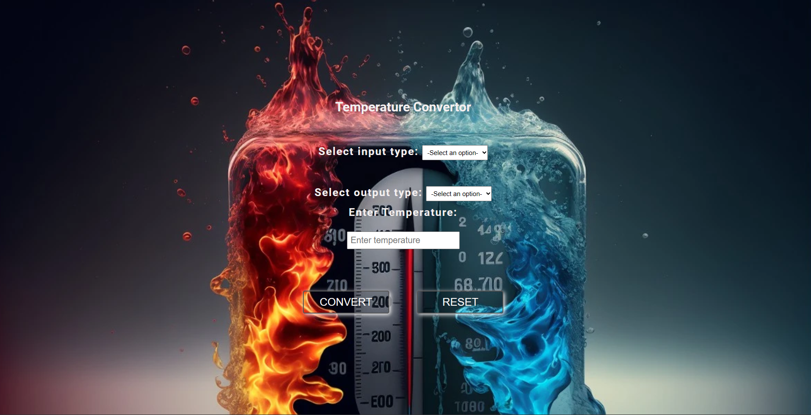

# Task 2: Temperature Converter

## Description

This is Task 2 of the BharatIntern Internship program, where you were tasked with creating a simple temperature converter web application. This application allows users to convert temperatures between Celsius, Fahrenheit, and Kelvin. The application provides a user-friendly interface and real-time temperature conversion as the user interacts with it.

## Features

- Convert temperatures between Celsius, Fahrenheit, and Kelvin.
- Real-time conversion as you type or select temperature values.
- User-friendly and responsive design.

## Technologies Used

- HTML
- CSS
- JavaScript

## Screenshot

